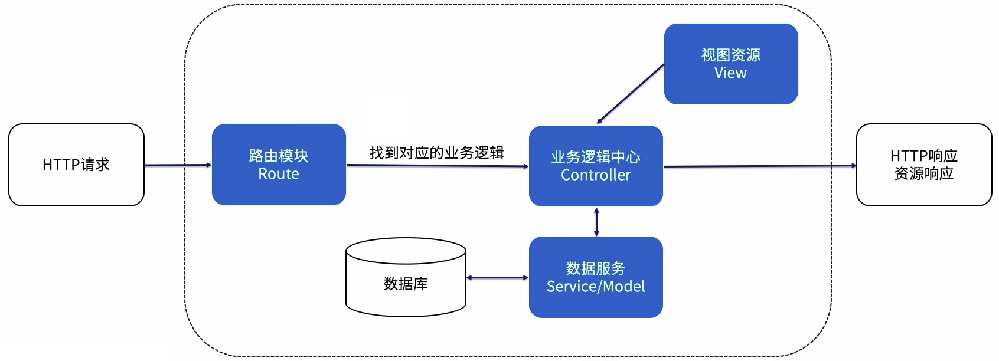

##### 一、Express的能力

封装http模块，方便地创建Web应用

通过中间件机制实现可拓展性

提供路由机制，便于组织业务应用

提供多种模板引擎，支持了静态文件的渲染和托管

便于添加错误处理，方便对系统进行容错处理

便于添加数据库连接，操作数据库数据

##### 二、Express中间件（核心部分）

路由和中间件是Express的基础，路由是特殊的中间件

 Express是一系列中间件函数调用的过程

中间件是对处理过程的封装，输入请求对象/响应对象，通过next进入下一个中间件处理过程

使用app.use()将中间件注册到应用实例上，路由中间件注册到路由实例上

##### 三、Express路由机制

路由是一段Express 代码，它将 HTTP动词、URL 路径/模式和处理西数三者关联起来。

Express的应用程序设计要从路由设计入手，将服务的能力描述出来。

还可以使用Router中间件，实现路由逻辑模块化设计。

##### 四、Express最佳实践

使用中间件压缩响应数据，在反向代理层做更佳。

避免在业务逻辑处理中使用同步阻塞操作。

引入完善的基建保障，记录日志，处理异常。

需要重启的时候立刻重启，保证程序可以自动重新启动。

##### 五、Express相关资料

| 标题                                              | 网址                                                         |
| :------------------------------------------------ | :----------------------------------------------------------- |
| **Express 官网**                                  | https://www.expressjs.com.cn/                                |
| **MDN 中提供的 Express 课程**                     | https://developer.mozilla.org/zh-CN/docs/learn/Server-side/Express_Nodejs/Introduction |
| **使用 Node.js + Express 搭建一个简单的微博网站** | https://cythilya.github.io/2014/11/23/nodejs-express-microblog/ |
| **NodeJS express框架核心原理全揭秘**              | https://zhuanlan.zhihu.com/p/56947560                        |
