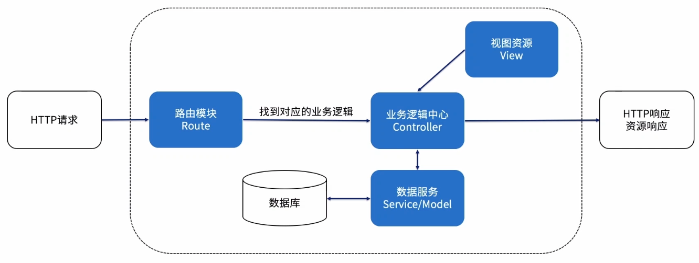

##### 一、Express实战-邮件模版系统

###### 1. 需求目标

实现一个可以生成邮件的模板管理系统

有配置界面，可以沉淀业务域中的邮件模板，可以新增模板

可以预览最终的邮件样式

###### 2. 需求分析

###### 3. 功能设计

##### 二、使用Nodejs编写RESTFul API

###### 1. 什么是restful API

restful是一种暴露服务端资源的一种约定方式，提供获取这种资源的动词，基于rest架构的web server api 就叫restful api

###### 2. REST概览

2.1 URI资源定位

- REST 是面向资源的，而资源通过 URI 进行暴露。
- 通俗理解：URI表示一种在某个位置的资源，比如某某街道某某图书馆里的某某书

2.2 链接资源状态

- 服务器生成包含状态转移的表征数据，用来响应客户端对个资源的请求，客户端可据此了解状态转移的方式。
- 通俗理解：通过一个关键词不断向下深挖，比如百度搜索baike.baidu.com/item/Vanquish，baike.baidu.com/item/阿斯顿马丁，而baike.baidu.com/item/就是个搜索类的关键词

2.3 使用HTTP己有特性

- REST很好利用了HTTP本身的一些特征，如HTTP动词、HTTP状态码，HTTP头部信息。
- 充分利用http描述URI资源
  - http动词：执行http的CURD操作，GET 获取资源R，POST 新建资源C，PUT 更新资源U，DELETE 删除资源D
  - http状态码：200请求成功，400客户端错误，服务端错误
  - http头部：Authorization 认证报头Cache-contral缓存报头Content-Type 消息体类型报头
  - Hypermedia：返回结果中提供链接，连向其他API方法，使得用户不查文档，也知道下一步应该做什么

2.4 统一资源规范

- 包含一组受限的预定义的操作，资源都通过使用相同的接口进行资源的访问。
- 通俗理解：我们对于数据的获取用GET，对于数据的创建用POST

###### 3. REST接口设计

 

###### 4. REST接口设计-路由

针对于邮件模版系统进行REST风格的路由设计

- GET /xhr/v1/template?page=1&size=10

- GET /xhr/v1/template/1

- POST /xhr/v1/template

- PUT /xhr/v1/template/1

- DELETE /xhr/v1/template/1

###### 5. 数据表设计-封装数据服务

选用MongoDB存储数据

引入mongoose构建数据模型

邮件模板Schema

- id String 唯一识别邮件模板的id

- template text 可支持HTML

- data 邮件模板中填充的数据

###### 6. REST最佳实践

充分理解并使用HTTP请求

使用API测试工具而非浏览器测试你的API接口

选择合适的文档生成工具，输出AP1文档

REST只是规范并不强制，最合适团队的才是最好的

找一个实践REST较好的框架胜过自己造轮子

##### 三、实战部分

项目目录：node/Express/template

##### 四、RESTFUL API相关资料

| 标题                             | 网址                                                         |
| :------------------------------- | :----------------------------------------------------------- |
| 10分钟构建Node.js REST风格的 API | https://zhuanlan.zhihu.com/p/27162732                        |
| 理解RESTful架构                  | https://www.ruanyifeng.com/blog/2011/09/restful.html         |
| RESTful API 最佳实践             | https://www.ruanyifeng.com/blog/2018/10/restful-api-best-practices.html |
| 什么才是真正的 RESTful 架构？    | https://juejin.im/entry/57b5cce45bbb500063061b1c             |