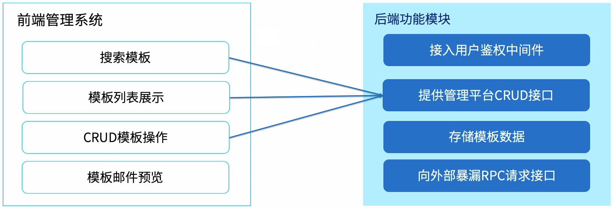

##### 一、Express实战-邮件模版系统

###### 1. 需求目标

实现一个可以生成邮件的模板管理系统

有配置界面，可以沉淀业务域中的邮件模板，可以新增模板

可以预览最终的邮件样式

###### 2. 需求分析

###### 3. 功能设计

##### 二、使用Nodejs编写RESTFull API

| 标题                             | 网址                                                         |
| :------------------------------- | :----------------------------------------------------------- |
| 10分钟构建Node.js REST风格的 API | https://zhuanlan.zhihu.com/p/27162732                        |
| 理解RESTful架构                  | https://www.ruanyifeng.com/blog/2011/09/restful.html         |
| RESTful API 最佳实践             | https://www.ruanyifeng.com/blog/2018/10/restful-api-best-practices.html |
| 什么才是真正的 RESTful 架构？    | https://juejin.im/entry/57b5cce45bbb500063061b1c             |