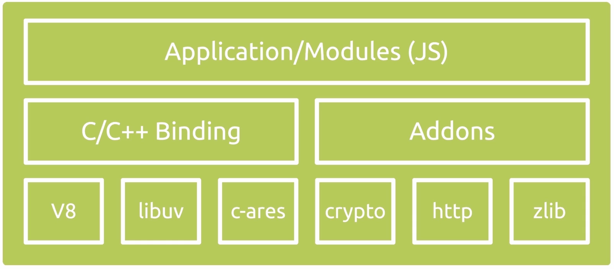
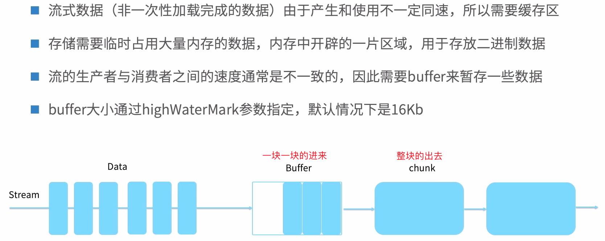
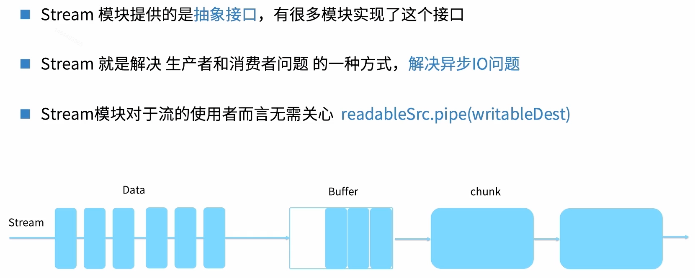
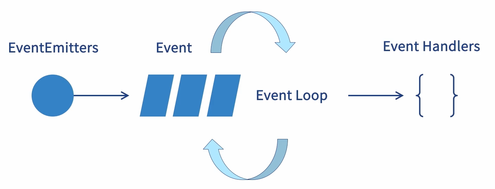
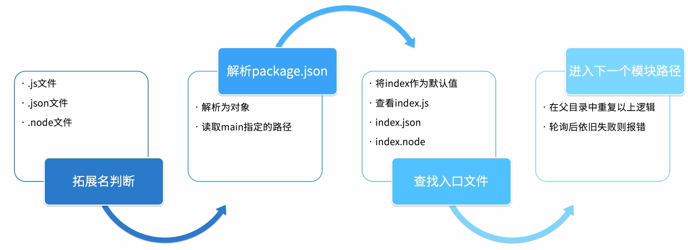
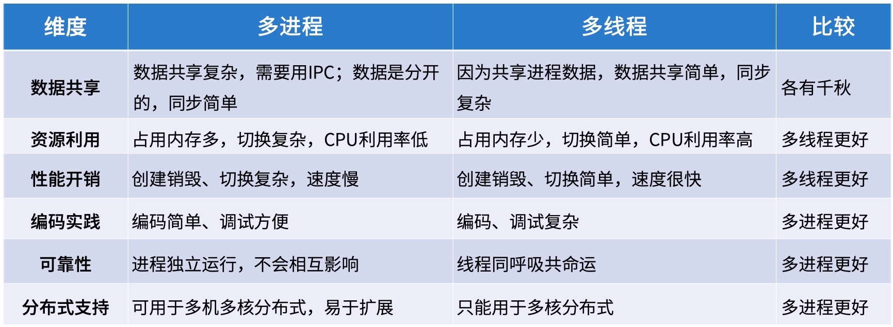
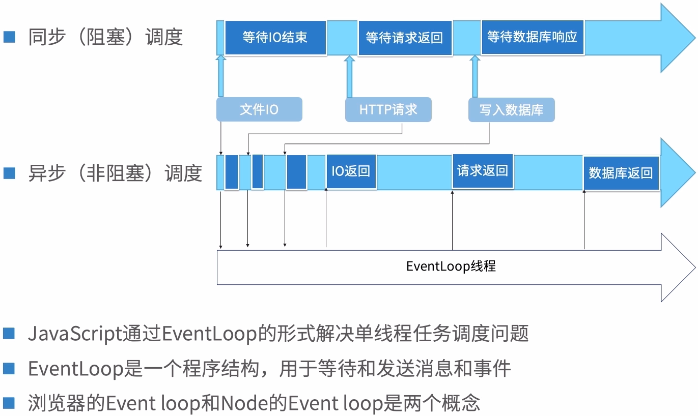
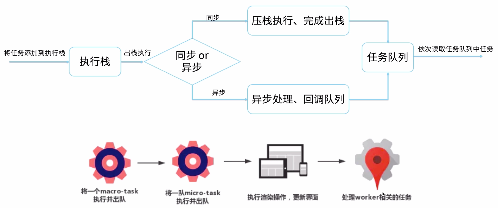
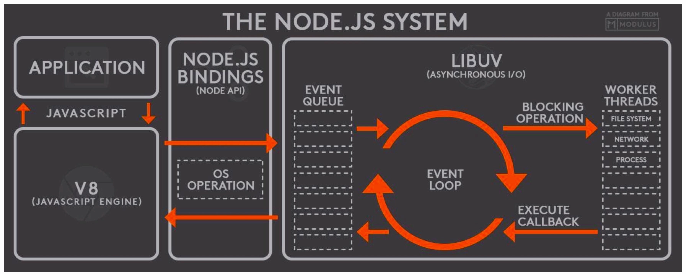

#### 一、node简介

##### 1. node模块机制

- Node本身是由模块组成的，采用commonJS/ESM规范

- node生态环境也是由数以万计的模块（包）组成的

- 每个文件都是一个模块，都有自己的作用域

- 在一个文件中定义的变量、函数、类，都是私有的，对其他文件不可见（比如命名冲突）

- 在node中，模块的加载是运行时同步加载的（先加载进来，然后再去执行别的代码）

- 模块可以多次加载，但是只会在第一次加载时运行一次，然后运行结果就被缓存了


##### 2. 模块加载机制require/export

路径类型

1. 绝对/相对路径，查找路径下是否存在文件
2. 内置模块，直接返回模块

3. 没有路径，根据所在的父模块确定安装目录，在目录中查找入口文件，比如第三方库lodash

4. 缓存的概念
   1. 缓存中存在的，直接返回
   2. 内置模块，则直接加载
   3. 根据找到的文件创建新模块并缓存


##### 3. 模块生态机制管理：npm

- npm代指node的模块生态，又代指模块安装CLI工具

- 通过package.json来描述项目基本信息和依赖，组成树状结构

- 使用nvm管理node版本，使用nrm管理npm源，使用npx执行命令

- 使用yarn加速包下载

- 使用scripts组织工程化脚本入口


##### 4. Nodejs能力

1. 跨平台：前端、移动端、PC端
2. node后端：测试、部署、Apirpc、微服务、Web应用

3. 前端框架演进：react/vue

4. 工具：各种预编译、构建工具 Webpack/gulp、工程化Hack技巧、npm等


##### 5. Node缺点

node虽然无所不能，但也有其不适合的事情，比如计算量比较大的事情。node更适合做高I/O（吞吐量）的事情


#### 二、node原生API（上）

##### 1. Nodejs架构

<div align="left">
  
</div>

v8引擎：谷歌开源c++实现的高性能js引擎，v8会将你的代码编译为机器码（我理解为0和1），它跑在JS引擎线程里

libuv：node的灵魂所在，提供异步功能（event loop）的c库，维护线程池处理文件操作，运行时负责事件循环，处理网络、dns相关事务

c-ares：它是c/c++组件库，比如还有http parse、open ssl、他们主要提供了对应系统功能的访问，包括http（网络）、crypto（加密）等等

Application/Modules：node的核心、npm install过来的第三方包都在这里

C/C++ Binding：node应用虽然是用js来写的，但在实现过程中用了很多c/c++的库。不同的高级计算机语言之间是不互通的，Binding就解决了这一点，让js、c、c++之间数据互通。而nodejs中的Binding主要就是把在nodejs中用c写的库接口暴露出去给js环境用，完成桥接。

Addons：这也是c++的部分


##### 2. nodejs基础数据类型

这里的数据类型和js的数据类型是不一样的，nodejs封装的基础包，用来实现更多的nodejs核心模块，在nodejs里面他们是相互调用的，比如node基础数据类型event，nodejs是基于事件驱动的，所以event来支持这个功能

###### 2.1 Buffer

> 内存空间不计算在js引擎线程内存空间上，而内存大小是有限制的：32位系统约1g，62位系统约2g
>
> Buffer其实可以理解为一个小区块，帮助我们来存临时的东西、缓冲数据，真实的使用场景实在流（stream）当中去使用
>
> <div align="left">
>   
> </div>
>
> 
>
> - 创建Buffer
>
>   ```
>   Buffer.from(bufferlarraylstring) 使用堆外内存新增Buffer
>   Buffer.from(arrayBuffer） 浅拷贝arrayBuffer，共享内存
>       
>   Buffer.alloc(size)分配一个指定大小的Buffer，默认填0，使用UTF-8编码
>   Buffer.allocUnsafe(size) 分配一 个未初始化的Buffer
>       
>   流式数据会自动创建Buffer，手动创建Buffer需谨慎
>   ```
>
> 
>
> - 创建Buffer的坑
>
>   ```
>   预分配一个内部的大小为 Buffer.poolSize(8K) 的Buffer 实例，作为快速分配的内存池
>   如果allocUnsafe/from(array）的size小于4K，则从预分配的池子中分配
>       
>   绕开V8回收机制，使用专用回收机制，提高性能和内存使用效率
>   但这种玩法会导致未初始化的数据块投入使用，造成数据泄露风险
>   ```
>
> 
>
> - 使用Buffer
>
>   ```
>   转换格式
>   - 字符串：编码Buffer.from(string)，解码buf.toString()
>   - JSON：buf.toJSON()
>       
>   剪裁和拼接
>   - 剪裁：Buffer.slice()表现与Array.slice()不同，返回Buffer与原buf共享内存
>   - 拼接：buf.copy/buf.concat 返回新的Buffer
>       
>   比较和遍历索引
>   - 判断相等：bufl.equals(buf2)比较的是二进制的值
>   - 索引：使用buftindex形式进行索引，for.of/indexOf/includes等Array方法也可以使用
>   ```

###### 2.2 Stream

> <div></div>

###### 2.3 event/EventEmitter

> <div></div>

###### 2.4 Error

> - 错误种类标
>
>   ```
>   准的Javascript错误，比如：SyntaxError / ReferenceError
>   
>   底层操作触发的系统错误，比如：文件读写
>   
>   用户自定义错误
>   
>   异常逻辑出发的AssertionError，通常来自assert模块
>   ```
>
> - 错误冒泡和捕获
>
>   ```
>   所有通过 Node.js 或 Javascript 运行时拋出的异常都是 Error 实例
>   
>   大多数的异步方法都接受一个 callback 函数，该函数会接受一个Error对象传入作为第一个参数
>   ```
>
> - 好好读一下Nodeis内置的错误信息，通常是见文知意的。例如 ERR_ARG_ NOT_ITERABLE

###### 2.5 URL

> 弃用url Objects，改用WHATWG URL
>
> 使用URLSearchParams操作参数

###### 2.6 global

> 看上去像是全局变量的存在，实际上仅存在于模块的作用域当中
>
> - `__dirname`、`__filename`、`exports`、`module`、`require()`，这些都是全局的存在，不需要引入就能使用
>
> 从JavaScript继承而来的全局变量
>
> - `console`、`timer全家桶`、`global（容器）`
>
> Nodejs特有的全局变量
>
> - `Buffer`、`process`、`URL`、`WebAssembly`，比如说new Buffer的时候就不需要import一个Buffer，也就是说在nodejs架构中有这些数据类型的实现，供开发者们直接使用


##### 3. nodejs工具库

###### 3.1 util

本是内置模块开发时的公共工具集，现已开放给开发者使用

> 风格转换
>
> - promisify <=> callbackify、 TextEncoder<=> TextDecoder
>
> 调试工貝
>
> - debuglog、 inspect、format、getSystemErrorName
>
> 类型判断
>
> - types.isDate(value)

###### 3.2 assert

内置断言库，需要配合测试框架使用，主动抛出AssertionError错误

> 断言真假
>
> - assert(value, msg)，match(string, reg)
>
> 断言等价
>
> - strictEqual/deep StrictEqual 以及相反操作 equal/ deepEqual弃用
>
> 断言成功失败
>
> - fail/throws/doesNotThrow/ifError/rejects

###### 3.3 querystring

官方提供的解析和格式化 URL 查询字符串的实用工具

> - 查询字符串转键值对 querystring.parse(str[, sep[, eq[, options]]])
>
> - 键值对转查询字符串 querystring stringify(obj)


##### 4. nodejs文件操作能力

###### 4.1 文件操作能力-os

> os模块提供了与操作系统相关的实用方法和属性
>
> 通过兼容的方式调用不同平台的底层命令，形成系统快照
>
> - `cpus`、`platform`、`type`、`uptime`、`userlnfo`
>
> 定义操作系统级别的枚举常量
>
> - 信号常量 `SIG*`、错误常量`E*`、Windows特有 `WSA*`、优先级`PRIORITY_*`

###### 4.2 文件操作能力-fs

> fs模块模拟Linux环境，提供了用于与文件系统进行交互的 API
>
> 所有的文件系统操作都具有同步和异步的形式
>
> URI作为特殊的文件也可以被fs模块使用
>
> 操作文件夹
>
> - mkdir/rmdir
>
> 操作文件
>
> - chmod/open/read/write


#### 三、node原生API（下）

这里介绍Nodejs的核心模块

##### 1. Nodejs模块机制及原理

node如何加载、执行这些文件模块的？

模块引用：通过`require(module)`来引入`module`

模块定义：通过挂载在`module.exports`对象上实现定义

模块标识：通过路径标识引入的是哪个模块

###### 1.1 在`node`中引入（require）

require一个模块时，会经历路径分析、文件定位、编译执行、加入缓存这些过程

> **路径分析**
>
> 内置模块
>
> - 在Node进程开始的时候就预加载了
>
> - 加载的是二进制文件，无需定位和编译
>
> 文件模块
>
> - 通过NPM安装的第三方模块
>
> - 本地模块
>
> 模块内容
>
> - 函数、对象或者属性，如函数、数组甚至任意类型的JS对象
>
> 注意：优先级顺序，已缓存模块>内置模块>文件模块>文件目录模块>node_modules模块
>
> 
>
> **模块文件定位**
>
> 文件定位会经历以下过程，如图所示：
>
> <div align="left">
>   
> </div>
>
> 
>
> 
>
> **模块编译执行**
> 		.js 文件：
>
> - 通过fs模块同步读取后编译执行，末识别类型也会当做js处理
>
> .json 文件：
>
> - 通过fs模块同步读取后，用`JSON.parse()`解析并返回结果
>
> .node 文件：
>
> - 这是用` C/C++`写的扩展文件，通过`process.dlopen()`方法加载最后编译生成的
>
> 
>
> **模块js文件的编译**
>
> 注入全局变量
>
> - 以参数形式，注入`module/exports/require`方法
>
> - 同时注入路径解析时得到的`__filename/__dirname`
>
> 构造上下文执行环境
>
> - 闭包产生作用域，通过 `runlnThisContext()`执行
> - 将`function`对象挂载到`exports`对象上，并导出
>
> 
>
> **加入缓存以及清除缓存**
>
> 核心模块
>
> - 登记在`Native Module._ cache`上
>
> 文件模块
>
> - 封装后的方法以字符串形式存储，等待调用
>
> 清除缓存
>
> - 通过`delete require.cachelrequire.resolve(module]`

###### 1.2 require vs import

> import
>
> - ES6的规范
>
> - 静态加载模块
>
> - 编译的时候执行代码
>
> - 缓存执行结果
>
> - 按需引入，节省内存
>
> require
>
> - commonJS规范
>
> - 动态加载模块
>
> - 调用的时侯加载源码
>
> - 加载全部代码


##### 2. Nodejs网络编程能力

node作为最流行的`Web Server`，原生到底提供了哪些能力来支持网络编程？其实写web服务无非就是启动服务、编写可调用接口、将服务数据放至数据库

###### 2.1 Socket阐述

> 理论来说：
>
> 实现底层通信，几乎所有的应用层都是通过`socket`进行通信的
>
> 对`TCP/IP`协议进行封装，向应用层协议暴露接口
>
> `TCP/IP `协议族中，传输层存在两种通用协议：`TCP`、`UDP`
>
> `TCP`、`UDP`两种协议不同，因为不同参数的`socket `实现过程也不一样
>
> 通俗来说：
>
> `Socket`是网络节点之间相互通信的门户，网络编程可以理解为`Socket`编程
>
> `Socket`从`UNIX`牵引过来翻译成了`套接字` ，主要来描述ip地址和端口，并实现不同计算机或虚拟机之间的通信
>
> `Socket`也可以理解插座，一台主机就像布满插座的房间，而每个插座都有一个编号，提供的电压不一样，客户根据插入不同的电压来使用不同的电器，享受不同的电压
>
> 一台主机运行多个服务，每个服务都建立一个`Socket`并绑定在不同端口上，不同端口对应不同服务。

###### 2.2 net/dgram（传输层）

> `node`中对于`Socket`的实现，也就是说对于`TCP`协议、`UDP`协议分别是用`net`和`dgram`实现的，`net`是对`TCP`的封装，`dgram`是对`UDP`的封装
>
> `net`模块是`TCP/IP`的`Node`实现，提供了一些用于底层的网络通信的小工具
>
> `http.Server` 继承自`net.Server`
>
> http客户端与http服务端的通信均依赖于`socket` (net.Socket)
>
> - net. Server：TCP server， 内部通过`socke`t来实现与客户端的通信
>
> - net.Socket：本地`socket`的`node`版实现，它实现了全双工的`stream`

###### 2.3 net.Socket

> net.Socket对象是`TCP` 或` UNIX Socket` 的抽象
>
> net.Socket 实例实现了一个双工流接口
>
> API归纳
>
> - 连接相关 `connect`
>
> - 数据读写` write`
>
> - 数据属性 `bufferSize`
>
> - 地址相关 `address`

###### 2.4 http/https/http2（应用层）

> `HTTP模块`是`Node` 的门脸，是编写`Web Server`最常见的模块
>
> `Server`部分继承自`net.Server`，并对请求和响应数据进行了封装
>
> 也提供了 `request/get`的能力（也是从Socket封装上来的），允许高其他服务端发起HTTP请求
>
> Node封装了HTTPS/HTTP2的实现，可以轻松创建类HTTP服务
>
>  
>
> 小记：http是web连网的基础，封装的是http文本信息同时基于TCP/IP传输协议，并发送到网络上。http在每次请求之后都会释放链接，因此在http的链接是一种短链接。要保持客户端程序的在线状态，需要不断的对服务端发起连接请求，通常的做法是，即使不需要任何数据，客户端在一定时间内也要向服务端发起保持连接请求，服务端收到这样的请求之后并回复客户端，知道客户端还在线。如果服务端长时间没有收到客户端的请求，就认为客户端下线了。如果客户端长时间没有收到服务端的消息，就认为服务端挂了或者网络断开了


##### 3. Nodejs进程管理能力

> node是怎么管理这些js执行的？
>
> node是单线程吗？
>
> node耗时计算如何避免阻塞？
>
> node如何实现多进程的开启和关闭？
>
> node可以创建线程吗？
>
> 怎么做的进程守护？

###### 3.1 操作系统的进程与线程

> 运行任务的程序叫做“进程”，一个进程只能执行一个任务
>
> 进程并发：以多进程形式，允许多个任务同时运行；
>
> 线程并发：以多线程形式，允许单个任务分成不同的部分运行;
>
> 操作系统提供协调机制，防止冲突，共享资源
>
> `JavaScript`是单线程语言，所以多个任务只能排队进行

###### 3.2 多进程VS多线程

> <div>
>   
> </div>

###### 3.3 Event Loop 概念图解

> <div></div>

###### 3.4 浏览器的Event Loop 

> **① 介绍：**
>
> - 事件循环3大块，执行栈、多线程处理、任务队列
>
> - 执行栈处理同步以及异步任务的回调，执行完就出栈（栈就是内存，存放js基础类型、地址引用、以及函数的调用，遵循先进后出）
> - 任务队列分微宏两个任务，有人理解宏任务是在下一次事件循环的开头执行也没错。
>   - 宏任务特征：有明确的异步任务需要执行和回调，需要其他异步线程支持。比如http请求需要异步的http线程
>   - 微任务特征：没有明确的异步任务需要执行，只有回调，不需要其他异步线程支持。比如promise.then，只处理了回调而且由V8引擎来完成，并不需要其他线程来支持。从某些角度来说的话promise.then微任务并没有多线程的参与，都算不上是一个异步任务，只是书写代码的顺序修改了而已，放在了最后面。
>
> - js引擎线程处理js代码，而其他线程处理的是任务：定时器、http请求、事件触发，都有专门的线程处理
>
>  **② 浏览器的`Event Loop `执行过程如下图**
>
> <div></div>
>
> 
>
> - 在浏览器中，宏任务队列有多个，微任务队列只有一个，宏任务出队是一个一个执行的，而微任务是一队一队执行的
>
> - 执行栈可以理解为：存储函数调用的栈结构，遵循先进后出（FILO ）的原则

###### 3.5 Node.js的Event Loop 

> **① 介绍：**
>
> - node采用V8作用js的解析引擎，而`I/O`方面采用的是自己的`LIBUV`
>
> - `LIBUV`是基于事件驱动跨平台的抽象层，封装了不同操作系统的底层特性，对面提供统一的`API`
>
> - V8引擎解析js脚本，解析后的代码调用`node API`，`LIBUV`库负责`node API`的执行，将不同的任务分配给不同的线程形成`Event Loop`，然后以异步的方式返回给V8，V8再把结果返回给用户
> - nodejs的`Event Loop` 是在`LIBUV`里面实现的，其中`LIBUV`分6个阶段并按照顺序去反复执行，每当进入某一个阶段都会对应的从回调队列中抽取函数执行，当队列为空或执行回调函数达到系统设定值的时候，就会进入下一个阶段
>
> **② nodejs的`Event Loop `执行过程如下图：**
>
> - 应用进入V8进行解析 >> 调用node API >> 压栈到LIBUV >> 事件队列（EVENT QUEUE） >>  进入Event Loop循环 >> WORKER THREADS 执行 >> EXECUTE CALLBACK
>
> - <div></div>
>
> **③ nodejs中的event loop（这里说的是宏任务）有6个阶段，如下图**
>
> - <div></div>
>
> - 每当一个阶段被触发的时候就会去执行相对应的任务队列
> - nodejs中的宏任务有4种 Timer QUEUE、I/O QUEUE、CHECK QUEUE、CLOSE QUEUE
>
> - nodejs中的微任务有2种 process进程中的next tick方法、promise，在nodejs种不同的微任务会放入不同的微任务队列当中，比如promise会放入promise的回调队列中，process的next tick方法会放入process的next tick回调队列中
>
> - 在nodejs中，宏任务队列有多个，微任务队列也有多个，宏任务跟微任务一样也是一队一队执行的
> - 总体来说，node事件执行过程：
>   - 第一步：执行nodejs同步代码
>   - 第二步：执行微任务队列里面的所有内容，比如process的next tick队列、promise队列
>   - 第三步：执行每个阶段里宏任务的所有任务，完成以后返回第二步，也就是说执行完Timer全家桶里的所有宏任务以后（在浏览器取的是一个宏任务），再去执行所有微任务（process的next tick、promise），再去执行I/O事件回调的所有宏任务，再去执行所有微任务process的next tick、promise），每个（宏任务）阶段的间隙都会去执行微任务

###### 3.6 Node.js进程-process

> Process 是一个全局对象，无需 require 直接使用，提供进程描述
>
> process对象是EventEmiter的实例，暴露了进程事件的钩子
>
> - exit 监听进程退出
>
> - uncaughtException 监听异常
>
> 提供标准流输出，对应的是进程的I/O操作
>
> - node版本的console底层是由 stdio实现的
>
> - 数据流与其他双工数据流不同，同步写会阻塞进程导致性能开销

###### 3.7 Node.js进程创建-child_process/cluster

> child_process 是 Node.js 的内置模块
>
> - spawn：适用于返回大量数据，例如图像处理，二进制数据处理
>
> - exec：适用于小量数据，maxBuffer 默认值为 200*1024 超出崩溃
>
> - fork：衍生新的进程，进程之间是相互独立的，每个进程独立
>
> cluster 是 Node.js 的内置模块
>
> - Worker对象包含了关于工作进程的所有的公共的信息和方法
>
> - fork: 衍生新的进程，进程之间是相互独立的，每个进程独立
>
> - 使用主从模型轮询处理服务的负载任务，通过IPC通信

###### 3.8 进程守护

> 最佳实践说：该挂就挂，挂了怎么自启动？（使用工具实现进程守护-pm2）
>
> 进程并发：以多进程形式，允许多个任务同时运行;
>
> 线程并发：以多线程形式，允许单个任务分成不同的部分运行；
>
> 操作系统提供协调机制，防止冲突，共享资源
>
> JavaScript是单线程语言，所以多个任务只能排队进行


#### 四、node相关资料

| 标题                                        | 网址                                                         |
| :------------------------------------------ | :----------------------------------------------------------- |
| MDN 中提供的 Nodejs 课程                    | https://developer.mozilla.org/zh-CN/docs/learn/Server-side/Express_Nodejs |
| Nodejs中文文档站点                          | http://nodejs.cn/                                            |
| Nodejs安装详解                              | https://juejin.im/post/5d4fb52c518825219c281bd1              |
| Nodejs优秀项目集合                          | https://github.com/sindresorhus/awesome-nodejs               |
| 浏览器与Node的事件循环(Event Loop)有何区别? | https://blog.fundebug.com/2019/01/15/diffrences-of-browser-and-node-in-event-loop/ |
| Nodejs原生模块整理                          | https://itbilu.com/nodejs/core/N1tv0Pgd-.html                |
| Nodejs中的模块机制                          | https://juejin.im/entry/5b4b5081e51d451984696cb7             |
| 深入理解Nodejs中的进程与线程                | https://juejin.im/post/5d43017be51d4561f40adcf9              |
| Nodejs中文文档站点                          | http://nodejs.cn/                                            |
