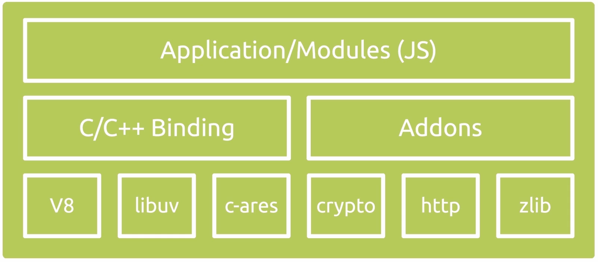
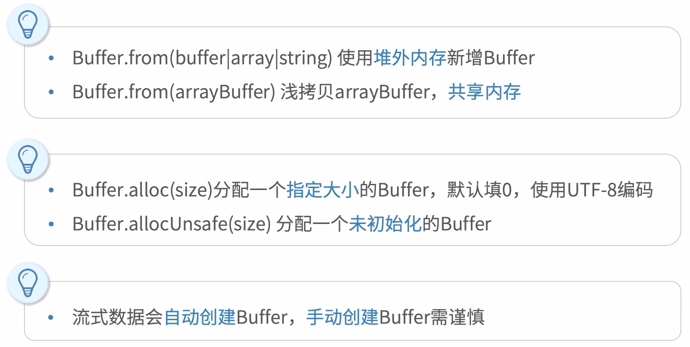
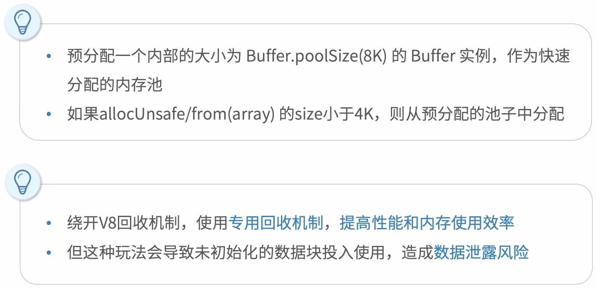
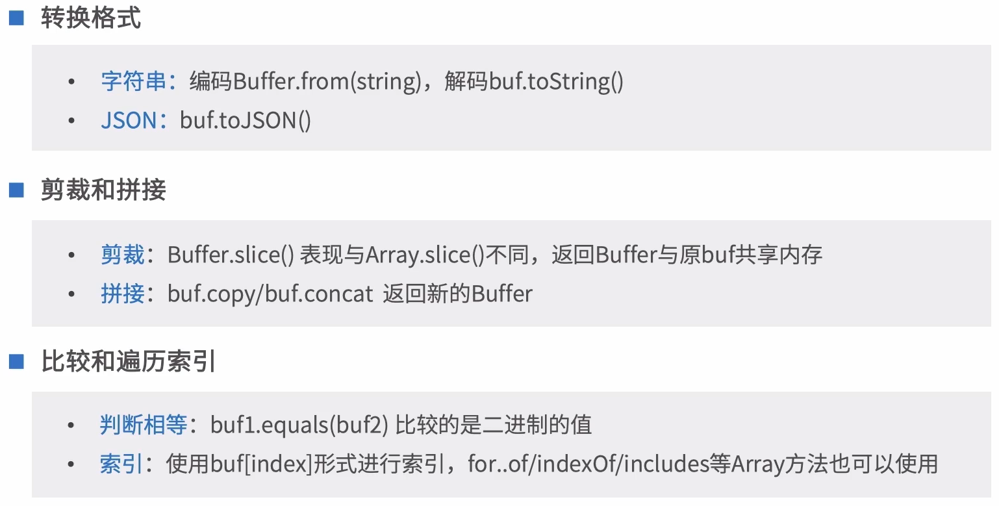
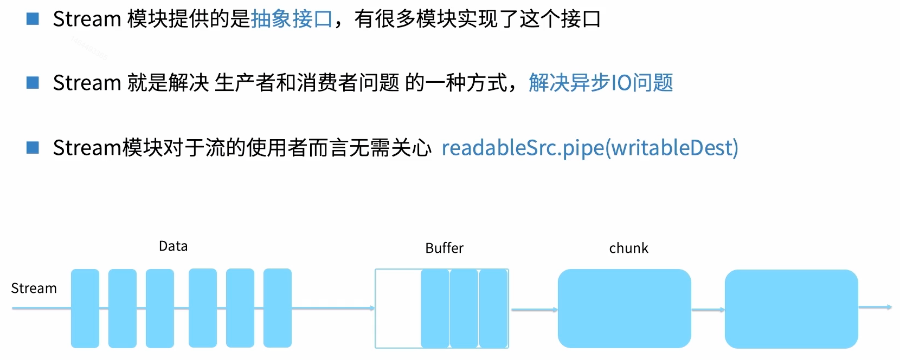
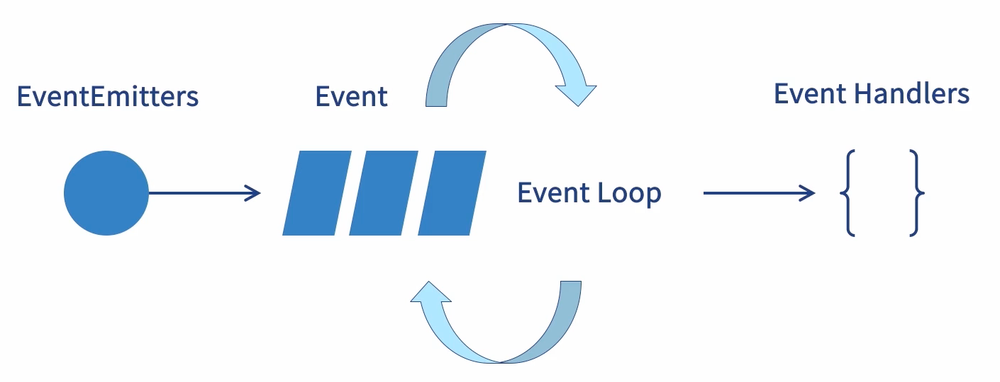

#### 一、node简介

##### 1. node模块机制

- Node本身是由模块组成的，采用commonJS/ESM规范

- node生态环境也是由数以万计的模块（包）组成的

- 每个文件都是一个模块，都有自己的作用域

- 在一个文件中定义的变量、函数、类，都是私有的，对其他文件不可见（比如命名冲突）

- 在node中，模块的家在是运行时同步加载的（先加载进来，然后再去执行别的代码）

- 模块可以多次加载，但是只会在第一次加载时运行一次，然后运行结果就被缓存了

##### 2. 模块加载机制require/export

路径类型

1. 绝对/相对路径，查找路径下是否存在文件
2. 内置模块，直接返回模块

3. 没有路径，根据所在的父模块确定安装目录，在目录中查找入口文件，比如第三方库lodash

4. 缓存的概念
   1. 缓存中存在的，直接返回
   2. 内置模块，则直接加载
   3. 根据找到的文件创建新模块并缓存

##### 3. 模块生态机制管理：npm

- npm代指node的模块生态，又代指模块安装CLI工具

- 通过package.json来描述项目基本信息和依赖，组成树状结构

- 使用nvm管理node版本，使用nrm管理npm源，使用npx执行命令

- 使用yarn加速包下载

- 使用scripts组织工程化脚本入口

##### 4. Nodejs能力

1. 跨平台：前端、移动端、PC端
2. node后端：测试、部署、Apirpc、微服务、Web应用

3. 前端框架演进：react/vue

4. 工具：各种预编译、构建工具 Webpack/gulp、工程化Hack技巧、npm等

##### 5. Node缺点

node虽然无所不能，但也有其不适合的事情，比如计算量比较大的事情。node更适合做高I/O（吞吐量）的事情

#### 二、node原生API

##### 1. Nodejs架构

v8引擎：谷歌开源c++实现的高性能js引擎，v8会将你的代码编译为机器码（我理解为0和1），它跑在JS引擎线程里

libuv：node的灵魂所在，提供异步功能（event loop）的c库，维护线程池处理文件操作，运行时负责事件循环，处理网络、dns相关事务

c-ares：它是c/c++组件库，比如还有http parse、open ssl、他们主要提供了对应系统功能的访问，包括http（网络）、crypto（加密）等等

Application/Modules：node的核心、npm install过来的第三方包都在这里

C/C++ Binding：node应用虽然是用js来写的，但在实现过程中用了很多c/c++的库。不同的高级计算机语言之间是不互通的，Binding就解决了这一点，让js、c、c++之间数据互通。而nodejs中的Binding主要就是把在nodejs中用c写的库接口暴露出去给js环境用，完成桥接。

Addons：这也是c++的部分

##### 2. nodejs基础数据类型

这里的数据类型和js的数据类型是不一样的，nodejs封装的基础包，用来实现更多的nodejs核心模块，在nodejs里面他们是相互调用的，比如node基础数据类型event，nodejs是基于事件驱动的，所以event来支持这个功能

###### 2.1 Buffer

> 内存空间不计算在js引擎线程内存空间上，而内存大小是有限制的：32位系统约1g，62位系统约2g
>
> Buffer其实可以理解为一个小区块，帮助我们来存临时的东西、缓冲数据，真实的使用场景实在流（stream）当中去使用
>
> 
>
> 创建Buffer
>
> 
>
> 创建Buffer的坑
>
> 
>
> 使用Buffer
>
> 

###### 2.2 Stream

> 

###### 2.3 event/EventEmitter

> 

###### 2.4 Error

> 

###### 2.5 URL

###### 2.6 global

##### 3. nodejs工具库

##### 4. nodejs文件系统